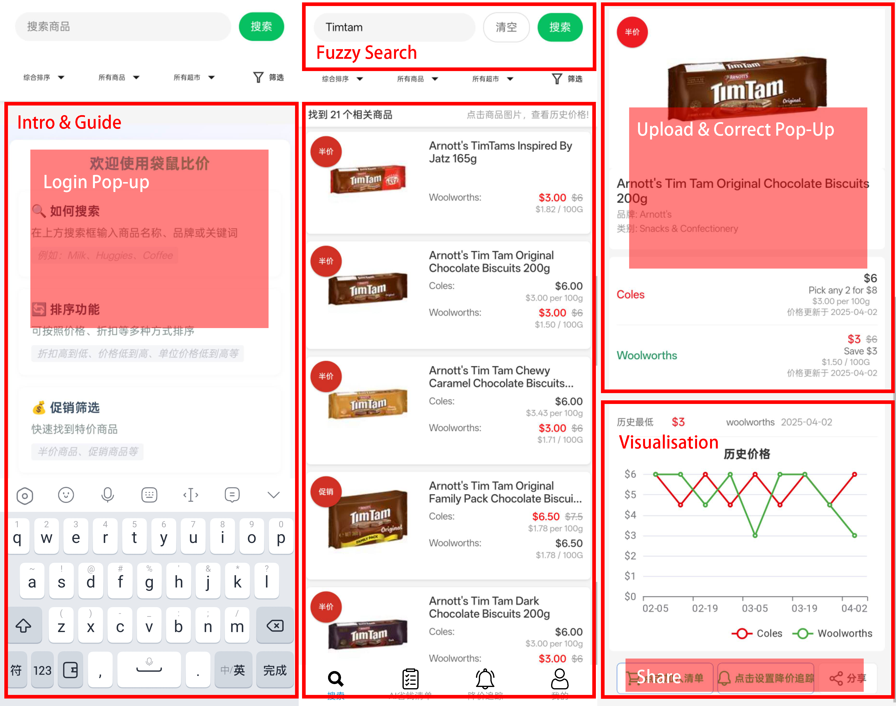

# Master Group 63

## Intro

**⚠️This `README.md` is a draft for GitHub preview while the project is in progress.**

It will be replaced by another `README.md` to explain the project, as required by the project specification.

---

Use following code to clone remote repo to local:

```bash
git clone https://github.com/Kaichao-Zheng/CITS5505-GroupProject.git
```

⚠️**Please always work on `yourOwnBranch`, NOT on the `origin/main` branch, which should only be used for merging.**

## Schedule

| Progress | Week        | Event                | Note                                                         |
| -------- | ----------- | -------------------- | ------------------------------------------------------------ |
|          | Week 6      | Project Release      |                                                              |
|          | Week 7      | First Meeting        | at 3.00pm, on 08 April                                       |
|          | Week 8      |                      |                                                              |
| ⌛        | Study Break |                      |                                                              |
|          | Week 9      | GUI Presentation     | [at 2:05pm, on 1st May, in MATH 123B](https://uniwa-my.sharepoint.com/:x:/g/personal/00112652_uwa_edu_au/EQXmSIthQ1FMjJQ1KADV7tUBN0DVQKh_OwTA4efE24TfrQ?e=vjnEQB) |
|          | Week 10     | Feature Presentation | [at 2:05pm, on 8st May, in MATH 123B](https://uniwa-my.sharepoint.com/:x:/g/personal/00112652_uwa_edu_au/EQXmSIthQ1FMjJQ1KADV7tUBN0DVQKh_OwTA4efE24TfrQ?e=vjnEQB) |
|          | Week 11     | Project Submission   | [at 11:59pm, on 16 May](https://lms.uwa.edu.au/webapps/blackboard/content/listContent.jsp?course_id=_101669_1&content_id=_4251653_1&mode=reset) |
|          | Week 12     | Group Presentation   |                                                              |

## High-Priority Tasks (Agile)

* Determine webpage size
* Template webpage code
* Modularity and task division

## Modular Reference



### Tech Stack

* HTML
* CSS + Bootstrap/Tailwin/SemanticUI/Fondation
* JQuery
* Flask
* AJAX or Websockets
* SQLite interfaced to via the SQLAlchemy package

## Group Members

| UWA ID   | Student Name      | GitHub User Name                                  |
| -------- | ----------------- | ------------------------------------------------- |
| 24141207 | Kai Zheng         | [Kaichao-Zheng](https://github.com/Kaichao-Zheng) |
| 24074951 | Tony Chu          | [TonyChyu](https://github.com/TonyChyu)           |
| 24205163 | Kushan Jayasekera | [kushanuwa](https://github.com/kushanuwa)         |
| 24112359 | Chang Liu         | [ChangLiu-UWA](https://github.com/ChangLiu-UWA)   |
