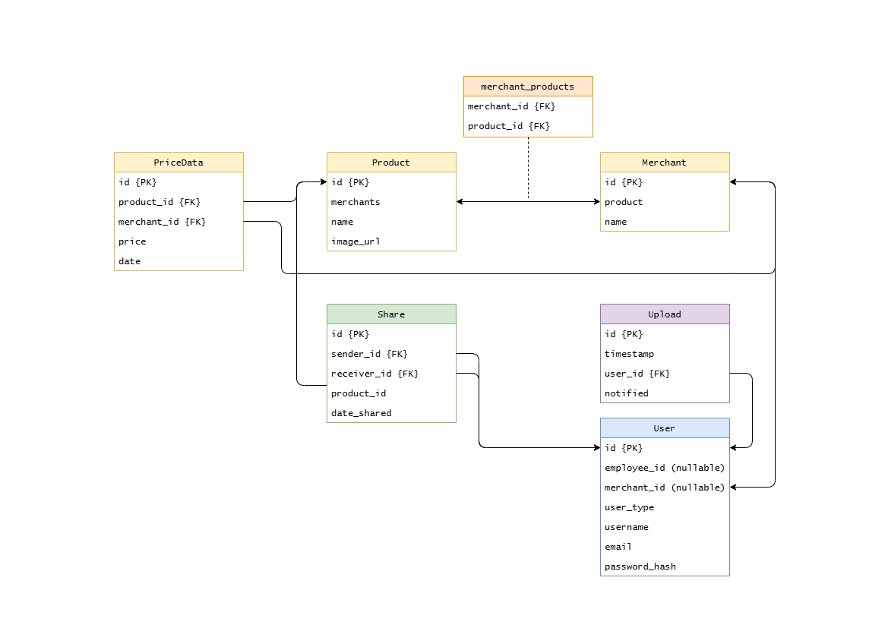

# Master Group 63

## Contributors

| UWA ID   | Student Name      | GitHub User Name                                             |
| -------- | ----------------- | ------------------------------------------------------------ |
| 24141207 | Kai Zheng         | [Kaichao-Zheng](https://github.com/Kaichao-Zheng)            |
| 24074951 | Tony Chu          | [TonyChyu](https://github.com/TonyChyu)                      |
| 24112359 | Chang Liu         | [ChangLiu-doc](https://github.com/ChangLiu-doc)              |
| 24205163 | Kushan Jayasekera | [kushanuwa](https://github.com/kushanuwa) / [kushjayz](https://github.com/kushjayz) |

## Overview

This `Price Trend` website aims to enhance user experience when identifying historical lowest prices among the overwhelming variety of promotional tags used by groceries and retailers. Users can register, log in, upload product price data, browse and predict price trends, and share product information or trends with other users through the platform. The platform also supports product image uploads, data visualization, and multi-user collaboration.

## Functionalities

This platform is suitable for consumers and data analysis enthusiasts who want to monitor price changes, compare prices across retailers, and predict future price trends.

- **Data Collection & Management**

  Supports batch uploading of product price data via CSV files, with automatic storage and management by the system.

- **Price Prediction**

  Generates historical price charts and future price forecasts for each product to help users make better purchasing decisions.

- **User Authentication**

  Allows user registration, login, and sharing of products and their price trends to facilitate information exchange.

- **Multi-Retailer Support**

  Integrates data from multiple retailers such as Coles, Woolworths, and JB Hi-Fi for easy comparison.

- **Extensibility**

  Uses the Flask application factory pattern to facilitate future feature expansion and maintenance.

## Project Structure

```bash
.
├── instance/
│   └── site.db               # development database
├── test/
│   ├── unitTests.py
│   └── systemTests.py
├── app/
│   ├── api_routes.py         # API route with prefix /api
│   ├── view_routes.py        # Frontend routes
│   └── db_models.py          # Database models (SQLAlchemy ORM)
├── .flaskenv                 # Environment config (FLASK_APP=main.py)
├── main.py                   # Flask Application Entry
└── README.md                 # Project Instruction
```

## Setup Instructions (WSL)

### 1. Clone the repository

```bash
git clone https://github.com/Kaichao-Zheng/CITS5505-GroupProject.git
```

### 2. Install Python3 and required tools

```bash
sudo apt-get install python3
sudo apt-get install python3-pip
sudo apt-get install python3-venv
```

### 3. Start your virtual environment

#### Create

```bash
python3 -m venv venv
```

#### Activate

```bash
source venv/bin/activate
```

### 4. Install project dependencies

```bash
pip install -r requirements.txt
```

### 5. Run the Flask development server

* The default localhost URL with port is [http://127.0.0.1:5000](http://127.0.0.1:5000)

```bash
flask run
```

### 6. Execute tests

#### Unit Tests

```bash
python -m unittest -b test.unitTests
```

#### System Tests

```bash
python -m unittest -b test.systemTests
```

> **💡if you want to run a testing server**
>
> ---
>
> Comment out to disable development server code in `main.py`.
>
> ```python
> '''Switch to run the real database `instance/site.db`'''
> # flaskApp = create_app(DeploymentConfig)
> # migrate.init_app(flaskApp, db)
> ```
>
> Uncomment to enable testing server code in `main.py`.
>
> ```python
> '''Switch to run a mock database in-memory for testing'''
> testApp = create_app(TestConfig)
> ```

### 7. Flask shell sample commands

⭐`SQLite Viewer` is a light-weight graphical extension in VSCode for browsing SQLite.

```bash
flask shell
```

#### CRUD

* Query

```python
>>> query = sa.select(User)
>>> users = db.session.scalars(query).all()
>>> users
[<User 1>, <User 2>, <User 3>]
>>> users[0].username
'admin_coles'
```

* Insert

```python
>>> user = User(id=999, username='your_name', user_type='merchant', email='your@email.com')
>>> user.set_password('passwd')
>>> db.session.add(user)
>>> db.session.commit()
```

* Update

```python
>>> id = 999
>>> user = User.query.get(id)
>>> user.username = 'new_name'
>>> db.session.commit()
```

* Delete

```python
>>> id = 999
>>> user = User.query.get(id)
>>> db.session.delete(user)
>>> db.session.commit()
```

#### Version control

* Apply newest schema version

```bash
flask db upgrade
```

* Record schema change in `db_model.py`

```bash
flask db migrate -m "commit_messages"
```

* Check current version

```bash
flask db current
```

* Check history versions

```bash
flask db history
```

* Roll back

```bash
flask db downgrade <version_hash>
```

⚠️**If you encounter issues, please check dependencies, database configuration, and port usage.**

## Appendix

**Jinja Template Inheritance (SSR)**


**Entity Relationship Diagram**


